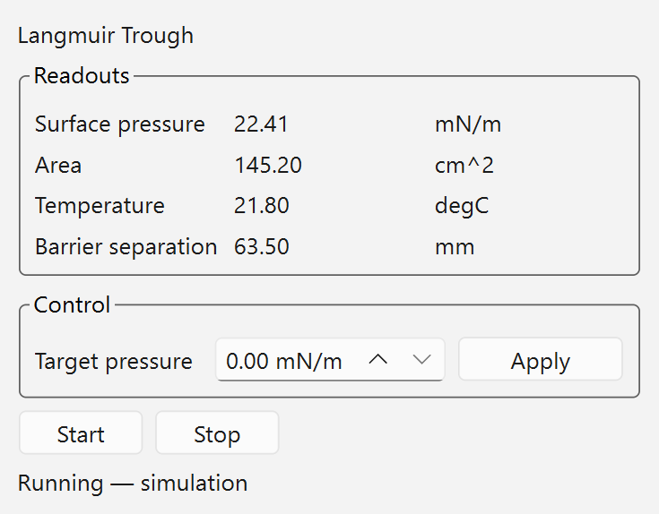

# A proposal: Qt Designer `.ui` files for new panels

**For:** Mrinal / nayanbera
**From:** the 15ID hutch group, working in a fork
**Date:** 2026-09-24
**Status:** proposal with a working demo — please judge the architecture, not the panel

---

## Where this comes from

We are building on `easy-bluesky` rather than writing our own client, because it already
does the hard parts: ZMQ to the queue server, CA coalesced at 10 Hz, the plan composer,
the Mongo and HDF5 browsers, `lmfit` fitting. Rebuilding any of that would be waste.

You are also developing it fast — **185 commits in the 31 days to 2026-09-24**, about six
a day. That is a good thing and we do not want to slow it down or fork away from it. It
does mean we have designed our work to stay out of your way: we add files rather than edit
yours, and we rebase onto your `master` rather than merging. Where we do want to change
something of yours, we would rather propose it than carry a patch. This is one of those.

**You have precedence here.** If you judge this a bad fit, we will build our panels the
way the codebase already does and that is a fine outcome.

---

## The proposal, in one sentence

For **new, statically-laid-out panels**, put the layout in a Qt Designer `.ui` file loaded
at runtime, and keep only behaviour in Python.

Not proposed: converting anything that already exists.

---

## The demo

Everything in this directory runs. Same panel, built twice:

| file | what it is |
|---|---|
| `trough_panel.ui` | layout, written and edited by Qt Designer |
| `trough_panel.py` | the `.ui` version — behaviour only |
| `trough_panel_handcoded.py` | the identical panel, built in Python the current way |
| `ui_loader.py` | the entire loading mechanism, ~20 lines |
| `test_ui_demo.py` | 10 tests, including a widget-tree equivalence proof |
| `measure.py` | reproduces the numbers below and the screenshots |

### Results

Measured with `docs/ours/ui-demo/measure.py`, code lines only — blank lines, comments and
docstrings excluded, so the explanatory prose in either file does not inflate the count:

| implementation | Python a human maintains | other |
|---|---:|---:|
| `trough_panel.py` + `trough_panel.ui` | **20** | 195 (XML, Designer-managed) |
| `trough_panel_handcoded.py` | **92** | 0 |

**78 % less Python**, and the two are not merely similar:

- `test_ui_and_handcoded_build_the_same_widget_tree` compares
  `(objectName, className, parentObjectName)` for every descendant widget. They match.
- The rendered PNGs are **byte-identical** (`md5 0e5ab210f37a110ab9ba96e8e8d71ad0`).

So the smaller version is not doing less. It is the same panel.

    $ /path/to/env/python -m pytest docs/ours/ui-demo -q
    10 passed in 0.12s

Run with conda-forge `pyqt6` 6.11.0 / Qt 6.11.2, headless (`QT_QPA_PLATFORM=offscreen`).
No hardware, no EPICS, no queue server.

---

## What we think it buys you

1. **Layout changes stop being code changes.** Open the `.ui` in Designer, drag, save,
   relaunch. No edit to a 3,000-line module, no risk of disturbing logic that happens to
   live next to the layout.
2. **Layout diffs read as layout.** A moved widget is a diff in a small XML file rather
   than a hunk buried in `experiments_tab.py`.
3. **`main.py` can stop growing.** Related but separable — see below.
4. **Beamline scientists can adjust their own screens.** This is the one we care about
   most. It is why people tolerate Phoebus: the editor is good enough that a user fixes
   their own panel instead of filing a request.
5. **It is testable.** `test_every_ui_file_in_the_repo_loads` walks the tree, so a broken
   or version-mismatched `.ui` fails in CI rather than as an empty panel mid-beamtime.
   New panels are covered automatically — there is no list to remember to update.

For scale, there are currently about **2,676 lines of layout code** across
`easy_bluesky/*.py` (8 % of 30,309), interleaved with logic in files up to 3,369 lines.
We are **not** proposing to touch any of it. That number is here only to say what the
convention would apply to if it were adopted for new work.

---

## What it costs, and where it does not apply

We would rather state these than have you find them.

- **A second file format.** Reviewers read XML as well as Python. The XML is verbose —
  195 lines for this panel — though Designer writes it and nobody hand-edits it.
- **Designer has to be installed and version-matched.** Ours is 6.11.2 against conda-forge
  `pyqt6` 6.11.0. A mismatch is exactly what the load test catches.
- **`pyuic` must never be run.** The moment a `.ui` is compiled to Python, the `.py`
  becomes what people edit and the next regeneration discards those edits. The whole
  benefit depends on this one negative rule, and it is easy to violate by habit.
- **It does not apply to dynamic layouts, and much of your UI is dynamic.**
  `ParamForm._make_widget()` builds widgets from a plan's parameter list; the Visual
  Composer builds blocks at runtime; the Mongo browser's field lists are rebuilt from
  whatever the run contains. None of that can or should be a `.ui`. This proposal covers
  **static** panels only, which is a real but bounded subset.
- **It is a convention, and conventions decay** unless something enforces them. The load
  test is that something; without it this is just a suggestion.

---

## The separable part: `main.py`

`main.py` took **40 commits in 31 days**, the most of any file. Your own
`docs/architecture.md` says adding a tab means importing it in `main.py` and adding a line
to `MainWindow._setup_ui()` — so every new tab, from anyone, edits the busiest file in the
repo.

We would like to propose an entry-point-based tab registry so tabs self-register and
`main.py` stops being touched for this. That is **independent** of the `.ui` question and
could be judged on its own; we mention it here because together they would let us add
panels without editing any of your files at all.

If you would rather we not touch `main.py` even to improve it, we will carry the change as
a local patch and it costs you nothing.

---

## What we are asking

Only that you look at the demo and say whether the direction is sound. Three possible
answers, all fine:

1. **Yes, upstream it** — we will open a PR adding `ui_loader.py`, the load test, and one
   real panel, and write it up in `docs/architecture.md` in your style.
2. **Yes, but keep it in your fork** — we will use it for our hutch panels only and not
   push it to you.
3. **No** — we will build our panels the way the codebase does today.

## Running it yourself

    conda create -p ./eb -c conda-forge --override-channels python=3.12 pyqt6 pyqtgraph pytest pytest-qt
    ./eb/bin/python -m pytest docs/ours/ui-demo -q
    ./eb/bin/python docs/ours/ui-demo/measure.py     # reproduces the table and the images

Then open `trough_panel.ui` in Designer, move something, save, and re-run `measure.py`.
That round trip — no Python touched — is the entire argument.
