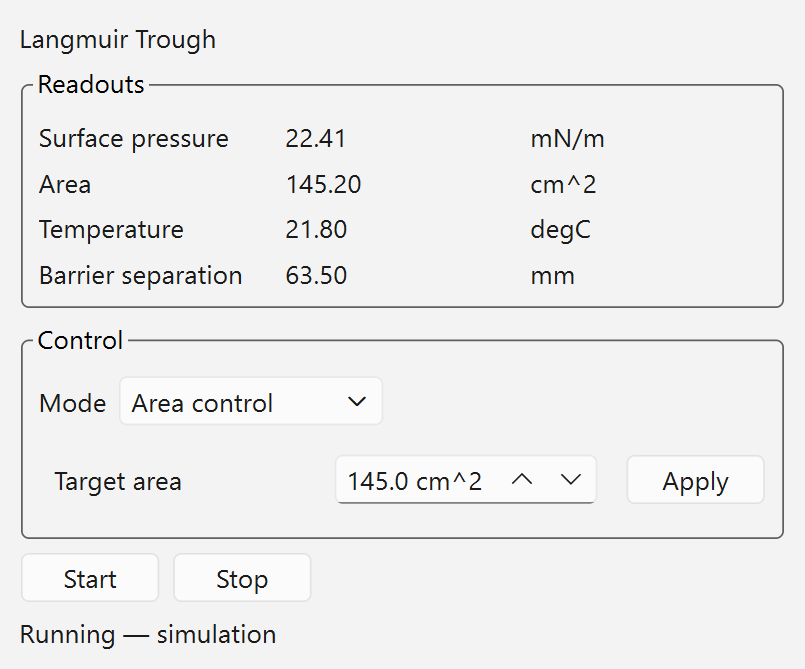

# A proposal: Qt Designer `.ui` files for new panels

**For:** Mrinal / nayanbera
**From:** the 15ID hutch group, working in a fork
**Date:** 2026-09-24
**Status:** proposal with a working demo — please judge the architecture, not the panel

---

## Where this comes from

We are building on `easy-bluesky` rather than writing our own client, because it already
does the hard parts: ZMQ to the queue server, CA coalesced at 10 Hz, the plan composer,
the Mongo and HDF5 browsers, `lmfit` fitting. Rebuilding any of that would be waste.

You are also developing it fast — **185 commits in the 31 days to 2026-09-24**, about six
a day. That is a good thing and we do not want to slow it down or fork away from it. It
does mean we have designed our work to stay out of your way: we add files rather than edit
yours, and we rebase onto your `master` rather than merging. Where we do want to change
something of yours, we would rather propose it than carry a patch. This is one of those.

**You have precedence here.** If you judge this a bad fit, we will build our panels the
way the codebase already does and that is a fine outcome.

---

## The proposal, in one sentence

For **new panels whose widget tree is known when you write the file**, put the layout in a
Qt Designer `.ui` loaded at runtime, and keep only behaviour in Python.

Not proposed: converting anything that already exists.

What "known when you write the file" excludes is narrower than it sounds, and it is worth
being precise about — see [What "static" means](#what-static-means-and-why-it-is-narrower-than-it-sounds).

---

## The demo

Everything in this directory runs. Same panel, built twice:

| file | what it is |
|---|---|
| `trough_panel.ui` | layout, written and edited by Qt Designer |
| `trough_panel.py` | the `.ui` version — behaviour only |
| `trough_panel_handcoded.py` | the identical panel, built in Python the current way |
| `ui_loader.py` | the entire loading mechanism, ~20 lines |
| `test_ui_demo.py` | 16 tests, including widget-tree equivalence and tree-invariance |
| `measure.py` | reproduces the numbers below and the screenshots |

The panel has live readouts, start/stop, and a **control-mode dropdown** that switches the
setpoint between pressure control and area control — including its units.

| pressure control | area control |
|---|---|
|  |  |

### Results

Measured with `measure.py`, code lines only — blank lines, comments and docstrings
excluded, so the explanatory prose in either file does not inflate the count:

| implementation | Python a human maintains | other |
|---|---:|---:|
| `trough_panel.py` + `trough_panel.ui` | **29** | 275 (XML, Designer-managed) |
| `trough_panel_handcoded.py` | **144** | 0 |

**79 % less Python** — and note the gap *widened* when we added the mode dropdown, from 72
lines to 115. The advantage scales with panel complexity, because complexity in a panel is
mostly structure.

The two are not merely similar:

- `test_ui_and_handcoded_build_the_same_widget_tree` compares
  `(objectName, className, parentObjectName)` for every descendant widget. They match.
- The rendered PNGs are **byte-identical** (`md5 51f72e3e7e0c509feaad2bec413af32b`).

So the smaller version is not doing less. It is the same panel.

    $ /path/to/env/python -m pytest docs/ours/ui-demo -q
    16 passed in 0.15s

Run with conda-forge `pyqt6` 6.11.0 / Qt 6.11.2, headless (`QT_QPA_PLATFORM=offscreen`).
No hardware, no EPICS, no queue server.

---

## What "static" means, and why it is narrower than it sounds

This is the part most likely to be misread, so it is worth being exact. "Static" does
**not** mean "nothing changes." The demo panel changes constantly — readouts update, the
status line rewrites, the setpoint page swaps, units change — and all of it is static.

### The actual rule

A `.ui` file fixes the **widget tree**: which widget objects exist, what classes they are,
how they nest, and which layout slot each occupies.

A `.ui` file fixes **nothing else**. Every property — `text`, `value`, `enabled`,
`visible`, `checked`, `minimum`, `suffix`, `styleSheet`, `toolTip`, the contents of a
combo box or table — is freely mutable at runtime.

So the question is never "does this panel change?" It is:

> **If I froze the program before any data arrived, could I still name every widget that
> will ever exist in this panel?**

Yes → static. Put it in a `.ui`.

### Things that look dynamic and are not

This list matters more than the definition, because these are where the judgement usually
goes wrong — in the *conservative* direction, costing editability for no reason.

| pattern | why it is static |
|---|---|
| Readouts updating at 4 Hz | `setText` is a property. No widget is created. |
| Enabling/disabling controls | property |
| **Showing/hiding widgets** | `setVisible` is a property. The widget exists either way. This is the most common mistake — building widgets conditionally when hiding them would do. |
| **`QStackedWidget` page switching** | All pages are named in the `.ui`. Your `live_viewer.py:295` and `hdf5_viewer.py:346` `_plot_stack` (1D vs 2D map) are exactly this. |
| Combo box items changing | Items are rows in a model, not child widgets. `_update_field_lists()` repopulating a Y-field combo is static. |
| Table / tree / list contents | `QTreeWidget` is *one* widget; its items are data. The device tree is static in this sense, however many devices appear. |
| pyqtgraph plots | Designer **widget promotion**: place a `QWidget`, promote it to `pyqtgraph.PlotWidget`, and `uic` instantiates the real class. Custom widgets are not a blocker. |
| Theme / stylesheet switching | `themes.py` sets properties |

**The mode dropdown in this demo is deliberately an example of this.** It changes the
visible page and the units of the setpoint, which *feels* structural. It is not, and
there is a test that proves it:

```python
def test_mode_switch_does_not_change_the_widget_tree(qtbot, cls):
    before = widget_tree(panel)
    panel.set_mode(AREA);      after_area = widget_tree(panel)
    panel.set_mode(PRESSURE);  after_back = widget_tree(panel)
    assert before == after_area == after_back
```

It passes for both implementations. Switching mode is one line:

```python
self.combo_mode.currentIndexChanged.connect(self.setpoint_stack.setCurrentIndex)
```

### Things that are genuinely dynamic

The test fails — you cannot name the widgets in advance — when **the number or class of
widgets depends on data that only exists at runtime**:

- **`ParamForm._make_widget()`** is the clearest case in your codebase. It branches on a
  parameter's type annotation, fetched from the RE Manager, and returns a different widget
  class per parameter — or `None` for callables. You cannot know how many spin boxes a
  plan needs until you have the plan.
- **The Visual Composer's blocks** — one block widget per step, count set by the user.
- Anything creating N *distinct widgets* for N runtime items, where model items would not
  serve.

### The part that actually matters: almost nothing is wholly dynamic

Panels are rarely all one or the other. The usual shape is a **static chassis with one
dynamic region**. Even the dialog hosting `ParamForm` is a title, a scroll area, an
OK/Cancel row, and *one* container whose contents are built at runtime.

So the rule is not "this panel is dynamic, therefore no `.ui`." It is:

> **Put the chassis in the `.ui`. Leave a named, empty container widget where the dynamic
> part goes. Populate that container in code.**

```python
load_ui("plan_dialog", self)          # title, scroll area, buttons — all static
for param in plan["parameters"]:      # the one genuinely dynamic region
    self.param_container.layout().addWidget(self._make_widget(param))
```

And a further step, if it is ever worth it: when the dynamic region creates *many copies
of the same row*, that row can itself be a `.ui` loaded N times. `.ui` describes the
repeated unit; code describes the repetition. We are not proposing that now — it is only
worth noting that "dynamic" does not put `.ui` out of reach even there.

### Why the asymmetry is reassuring

Getting this wrong in the conservative direction — treating something static as dynamic —
silently costs editability, and nothing tells you. Getting it wrong the other way is
harmless: you simply cannot express it in Designer, and you find out in the first minute.
The failure mode points the safe way.

---

## What we think it buys you

1. **Layout changes stop being code changes.** Open the `.ui` in Designer, drag, save,
   relaunch. No edit to a 3,000-line module, no risk of disturbing logic that happens to
   live next to the layout.
2. **Layout diffs read as layout.** A moved widget is a diff in a small XML file rather
   than a hunk buried in `experiments_tab.py`.
3. **`main.py` can stop growing.** Related but separable — see below.
4. **Beamline scientists can adjust their own screens.** This is the one we care about
   most. It is why people tolerate Phoebus: the editor is good enough that a user fixes
   their own panel instead of filing a request.
5. **It is testable.** `test_every_ui_file_in_the_repo_loads` walks the tree, so a broken
   or version-mismatched `.ui` fails in CI rather than as an empty panel mid-beamtime.
   New panels are covered automatically — there is no list to remember to update.

For scale, there are currently about **2,676 lines of layout code** across
`easy_bluesky/*.py` (8 % of 30,309), interleaved with logic in files up to 3,369 lines.
We are **not** proposing to touch any of it. That number is here only to say what the
convention would apply to if it were adopted for new work.

---

## What it costs

We would rather state these than have you find them.

- **A second file format.** Reviewers read XML as well as Python. The XML is verbose —
  275 lines for this panel — though Designer writes it and nobody hand-edits it.
- **Designer has to be installed and version-matched.** Ours is 6.11.2 against conda-forge
  `pyqt6` 6.11.0. A mismatch is exactly what the load test catches.
- **`pyuic` must never be run.** The moment a `.ui` is compiled to Python, the `.py`
  becomes what people edit and the next regeneration discards those edits. The whole
  benefit depends on this one negative rule, and it is easy to violate by habit.
- **Widget promotion is a small extra concept** for pyqtgraph and custom widgets — easy
  once, but it is a thing a newcomer has to be told.
- **It is a convention, and conventions decay** unless something enforces them. The load
  test is that something; without it this is just a suggestion.

---

## The separable part: `main.py`

`main.py` took **40 commits in 31 days**, the most of any file. Your own
`docs/architecture.md` says adding a tab means importing it in `main.py` and adding a line
to `MainWindow._setup_ui()` — so every new tab, from anyone, edits the busiest file in the
repo.

We would like to propose an entry-point-based tab registry so tabs self-register and
`main.py` stops being touched for this. That is **independent** of the `.ui` question and
could be judged on its own; we mention it here because together they would let us add
panels without editing any of your files at all.

If you would rather we not touch `main.py` even to improve it, we will carry the change as
a local patch and it costs you nothing.

---

## What we are asking

Only that you look at the demo and say whether the direction is sound. Three possible
answers, all fine:

1. **Yes, upstream it** — we will open a PR adding `ui_loader.py`, the load test, and one
   real panel, and write it up in `docs/architecture.md` in your style.
2. **Yes, but keep it in your fork** — we will use it for our hutch panels only and not
   push it to you.
3. **No** — we will build our panels the way the codebase does today.

## Running it yourself

    conda create -p ./eb -c conda-forge --override-channels python=3.12 pyqt6 pyqtgraph pytest pytest-qt
    ./eb/bin/python -m pytest docs/ours/ui-demo -q
    ./eb/bin/python docs/ours/ui-demo/measure.py     # reproduces the table and the images

Then open `trough_panel.ui` in Designer, move something, save, and re-run `measure.py`.
That round trip — no Python touched — is the entire argument.
